# Lords Regiment Dashboard

**The Lords are a player clan in [_Holdfast: Nations At War_](https://store.steampowered.com/app/589290/Holdfast_Nations_At_War/) — Anvil Game Studios' Napoleonic-era multiplayer shooter where up to 150 players share a server, hold rank-and-file formation, and fire volleys on an officer's shout over proximity voice chat.** Clans in that game call themselves _regiments_, which is where this project gets its name, and its rank ladder, and its medal cabinet, and very nearly every noun in the codebase.

This repository is the **Angular single-page app** those players actually use: a public site, Discord sign-in, and an authenticated command dashboard covering roster, events, gallery, recruitment, ranks & medals, an audit ledger and an admin console. It has been running the real thing at **[lordsofholdfast.com](https://lordsofholdfast.com)** since 20 July 2026.

<p align="left">
  <a href="https://github.com/Amitoj02/lords-regiment-dashboard/actions/workflows/ci.yml"></a>
  <a href="https://lordsofholdfast.com"></a>
  <a href="./package.json"></a>
  <a href="./package.json"></a>
</p>
<p align="left">
  <a href="./Dockerfile"></a>
  <a href="./LICENSE"></a>
  <a href="./CONTRIBUTING.md"></a>
  <a href="https://github.com/Amitoj02/lords-regiment-dashboard/commits/main"></a>
</p>

**Jump to:** [Welcome](#-welcome) · [Screens](#-a-tour-of-the-screens) · [Quickstart](#-quickstart) · [Architecture](#-architecture) · [API contract](#-the-contract-with-the-api) · [Design system](#-design-system) · [Scripts](#-npm-scripts) · [Testing & CI](#-testing--ci) · [Deployment](#-docker--deployment) · [Contributing](#-contributing)

---

## 👋 Welcome

If you have ever helped run a gaming community, you have probably lived this: a Discord server, a pinned message six months out of date, a spreadsheet nobody can edit, and one person who remembers who was promoted when. This is what happened when we stopped doing that and built the thing properly — and it is now open source so you can read it, fork it, borrow one good idea from it, or tell us where we got it wrong.

You do not need to have fired a musket to work on this. Under the period costume it is an ordinary Angular SPA: lazy-loaded feature modules, functional route guards, signal-backed auth state, a hand-rolled SCSS design system, and a REST API behind a relative `/api`.

Three kinds of visitor are welcome here, and the repo is arranged for all three:

- **Curious?** Skim [the screen tour](#-a-tour-of-the-screens), then poke at the real thing at [lordsofholdfast.com](https://lordsofholdfast.com).
- **Want to run it for your own community?** Start at the [quickstart](#-quickstart). Discord sign-in is **mocked** locally, so you can click through the entire product without registering an application anywhere.
- **Want to contribute?** [Jump to contributing.](#-contributing) First-time contributors are genuinely welcome, and _"I got lost in the setup"_ is a perfectly good issue to open — it means the docs failed, not you.

### The other half

This is one half of a two-repo product. Neither half is much use alone: the SPA has **no stub data**, every service calls the live API, and the two share a contract that has to move together.

|                          | Repository                                                                                  | Stack                                                              |
| ------------------------ | ------------------------------------------------------------------------------------------- | ------------------------------------------------------------------ |
| 🖥️ **Web (this repo)**   | [`Amitoj02/lords-regiment-dashboard`](https://github.com/Amitoj02/lords-regiment-dashboard) | Angular · Bootstrap 5.3 grid/reboot/utilities · SCSS design tokens |
| ⚙️ **API + Discord bot** | [`Amitoj02/lords-dashboard-backend`](https://github.com/Amitoj02/lords-dashboard-backend)   | NestJS 11 · TypeORM · MySQL 8.4                                    |

The two checkouts are expected to sit side by side (`../lords-dashboard-backend`), because the backend's Compose stack builds this app's container from that relative path.

---

## 🗺️ A tour of the screens

Someone who wants in signs in with Discord and files an enlistment application. An officer works the review queue and approves them onto the roster at the entry rank. From then on they RSVP to the week's line battles and drills, get the server password revealed once they have committed to turning up, collect medals, post clips and screenshots to a moderated gallery, and watch their own service record fill in behind them. Everything an officer does _to_ somebody else lands in an audit ledger, and every member can export or delete their own data without asking anyone.

Four areas, each a lazy-loaded feature module with its own route table.

| Area                       | Who sees it                 | What lives there                                                         |
| -------------------------- | --------------------------- | ------------------------------------------------------------------------ |
| **Public**                 | Anyone                      | Landing page, event calendar, gallery, sign-in, legal documents          |
| **Onboarding**             | Signed in, not yet a member | The enlistment form, your own application status, the Discord guild gate |
| **Member** (`/app/*`)      | Enrolled members            | Dashboard, roster, profiles, events, gallery, GDPR self-service          |
| **Admin** (`/app/admin/*`) | Owner / Admin / Moderator   | Applications queue, ranks & medals, audit ledger, settings, bot status   |

<details>
<summary><strong>Public</strong> — no authentication required</summary>

| Route                                 | What the visitor does                                                                                                                                                                                                            |
| ------------------------------------- | -------------------------------------------------------------------------------------------------------------------------------------------------------------------------------------------------------------------------------- |
| `/` · `/home`                         | Marketing landing: admin-authored hero banner and quote, regiment name and mission statement, live stats, the next three events, three recent gallery items, a Discord invite CTA (hidden when unconfigured) and "Apply to Join" |
| `/events`                             | Public calendar split into ongoing / upcoming / previous with RSVP counts; each card deep-links into the member event page when you're signed in, otherwise to `/login`                                                          |
| `/gallery`                            | Approved community media — All / Images / Videos / Links tabs, plus a tag filter bar with a top-five-and-more expander                                                                                                           |
| `/gallery/:id`                        | Full item view with embed, submitter, date, tags and caption; holders of `moderate_gallery` get an inline edit-and-delete panel right there                                                                                      |
| `/login`                              | A three-step explainer and one "Continue with Discord" button, beside a branding panel the admins author themselves                                                                                                              |
| `/terms` · `/privacy` · `/guidelines` | Legal documents rendered from admin-authored Markdown, with shipped fallback copy so the privacy policy still renders if the API is down                                                                                         |
| `/auth/callback`                      | The OAuth landing target. Reads the JWT from the URL **fragment**, `replaceState`s it away immediately, hydrates the session and routes on; `?error=<code>` shows the failure and bounces to `/login`                            |

</details>

<details>
<summary><strong>Onboarding</strong> — how a stranger becomes a member</summary>

| Route                | What happens                                                                                                                                                                                                                                                                                                         |
| -------------------- | -------------------------------------------------------------------------------------------------------------------------------------------------------------------------------------------------------------------------------------------------------------------------------------------------------------------- |
| `/onboarding/apply`  | The enlistment papers: name, in-game name, applicant type (Member or Mercenary), current regiment, how you found us, preferred classes, skills. The same screen doubles as the edit surface via `?edit=1` (PATCH instead of POST), and the Mercenary card hides itself when the regiment has that track switched off |
| `/onboarding/status` | Your own application: pending / held / declined, with a Reapply path unless you're blocked. Renders only the officer's message to you — staff-only notes and decline reasons never cross the wire to the applicant                                                                                                   |
| `/guild-required`    | The Discord guild gate. A signed-in user who isn't in the regiment's server is held here with an invite and an "I have joined" re-check that resumes the navigation they were interrupted on. Deliberately renders **no** app shell — the sidebar would link straight back into gated routes                         |

</details>

<details>
<summary><strong>Member</strong> — <code>/app/*</code>, inside the shell</summary>

| Route                                        | What the member does                                                                                                                                                                                  |
| -------------------------------------------- | ----------------------------------------------------------------------------------------------------------------------------------------------------------------------------------------------------- |
| `/app/dashboard`                             | Member home: upcoming events, recent gallery, your own honours — plus submission, review-queue and bot-status panels for staff                                                                        |
| `/app/roster`                                | Search and filter the roster by rank, role and status; the per-row `···` opens the staff action modal                                                                                                 |
| `/app/profile` · `/app/profile/:id`          | Header with banner and avatar; Gallery / Event history / RSVPs tabs; service record and last access (self or staff only); a self-edit dialog for in-game name and image uploads                       |
| `/app/dashboard/events`                      | The in-shell event list, with an archived toggle for holders of `manage_events`                                                                                                                       |
| `/app/dashboard/events/create` · `/:id/edit` | Guarded by `manageEventsGuard`. Title, description, banner upload, start/end date-time with timezone, server name/region/password, platforms, tags, recurrence cadence and notify-before offsets      |
| `/app/dashboard/events/:id`                  | RSVP (interested / tentative / declined), the attendee roster, reveal the decrypted server password (needs `reveal_event_passwords` **and** an RSVP), plus archive / complete / delete for moderators |
| `/app/gallery`                               | The members-only archive with a pending-count badge                                                                                                                                                   |
| `/app/gallery/submit`                        | `submitGalleryGuard`. Multi-file presigned upload, per-file captions, client-side video poster capture, tags                                                                                          |
| `/app/gallery/mod`                           | `moderateGalleryGuard`. Pending / approved / declined tabs; approve, or decline with a reason                                                                                                         |
| `/app/account-deletion`                      | GDPR self-service: download your own data as JSON, then type `DELETE` plus two confirmations to request → confirm → execute deletion                                                                  |

</details>

<details>
<summary><strong>Admin</strong> — <code>/app/admin/*</code></summary>

| Route                     | What the officer does                                                                                                                                                                                                                                                      |
| ------------------------- | -------------------------------------------------------------------------------------------------------------------------------------------------------------------------------------------------------------------------------------------------------------------------- |
| `/app/admin/applications` | The recruitment queue across pending / held / approved / declined / reapply. Approve (with the DM body), decline (staff note **plus** a separate message to the applicant), hold, block or unblock; the decision chip deep-links the deciding officer's profile            |
| `/app/admin/ranks`        | CRUD and drag-reorder for the rank ladder and the medal cabinet, icon uploads, link or unlink each to a Discord role, and a live poll of a bulk role re-link batch with per-failure-class counts and a cancel button                                                       |
| `/app/admin/audit`        | The audit ledger: search, actor, action and date-range filters, a row-detail modal with a JSON before/after diff, and CSV export                                                                                                                                           |
| `/app/admin/settings`     | Five sections in two groups — _Regiment_: profile & visibility, Discord & Adjutant, roles & permissions (`manage_settings`); _Public pages_: landing & sign-in, legal documents (`manage_regiment_details`). Entry is `settingsAccessGuard`; exit is `unsavedChangesGuard` |
| `/app/admin/bot`          | Connection snapshot, verify-connection, full role resync, recent bot operations with a resolve action. Reached from Settings; intentionally absent from the sidebar                                                                                                        |

</details>

### Screenshots

<table>
<tr>
<td width="16.66%">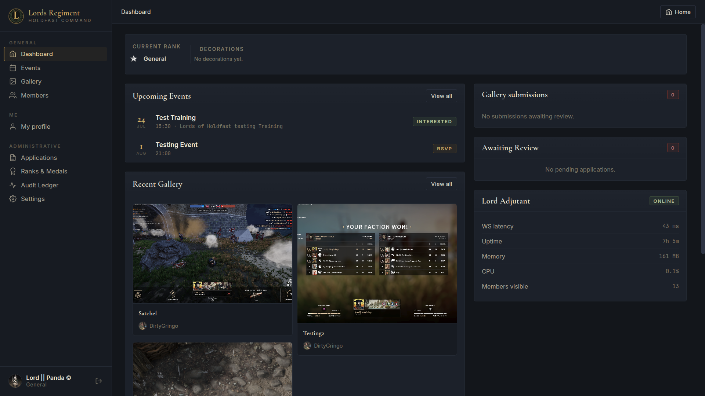</td>
<td width="16.66%">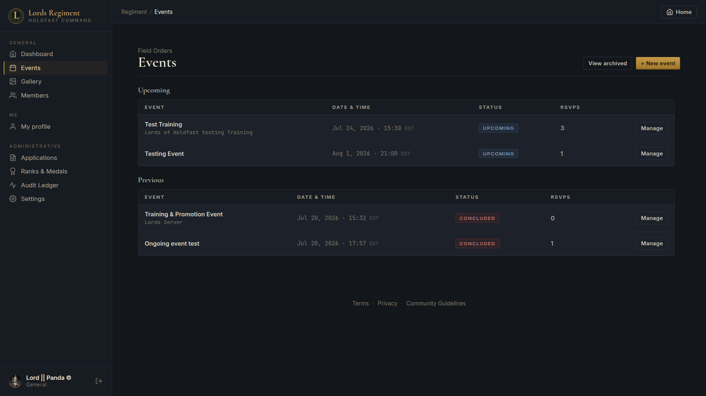</td>
<td width="16.66%">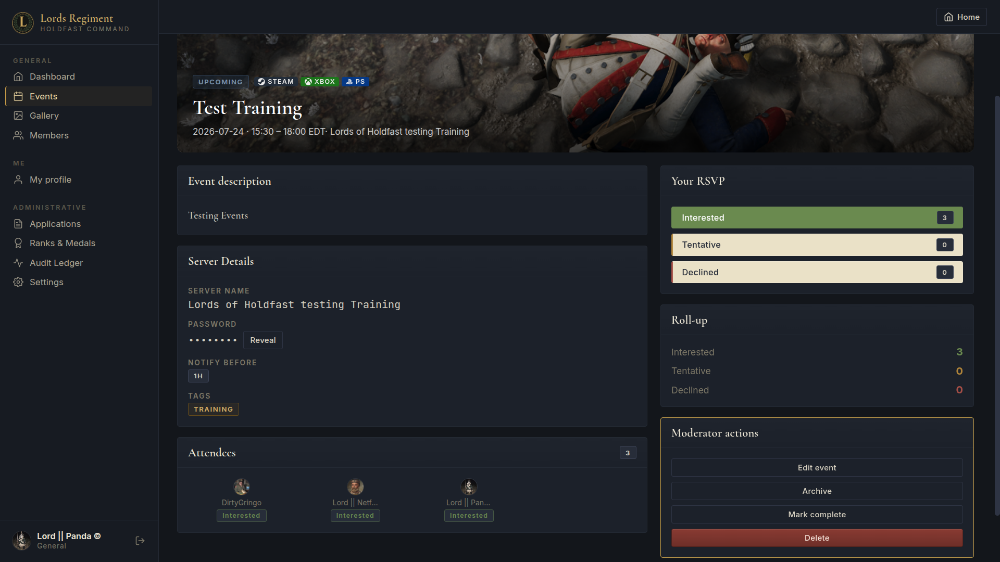</td>
<td width="16.66%">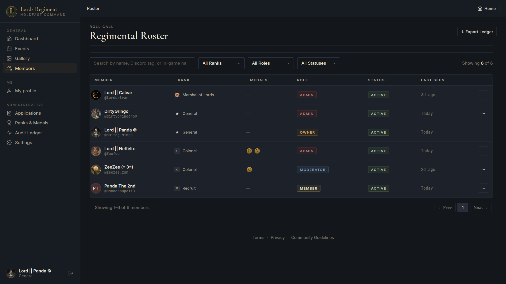</td>
<td width="16.66%">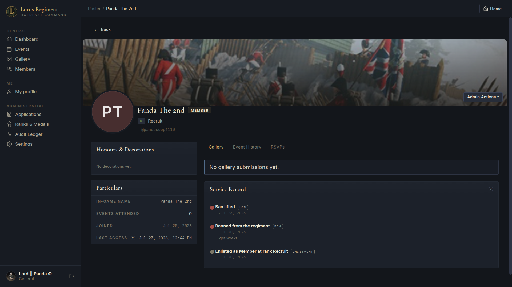</td>
<td width="16.66%">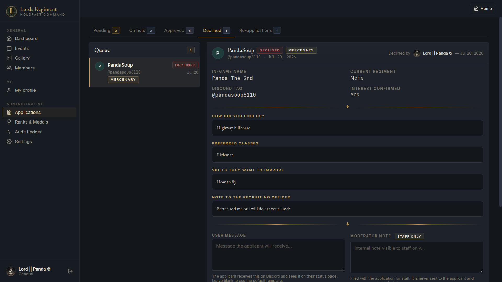</td>
</tr>
<tr>
<td width="16.66%">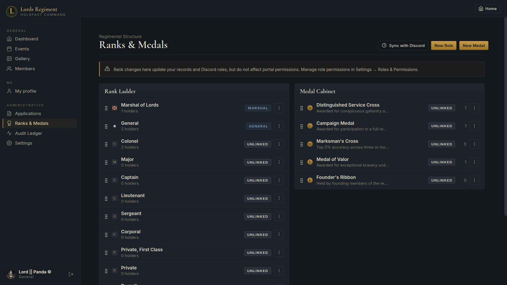</td>
<td width="16.66%">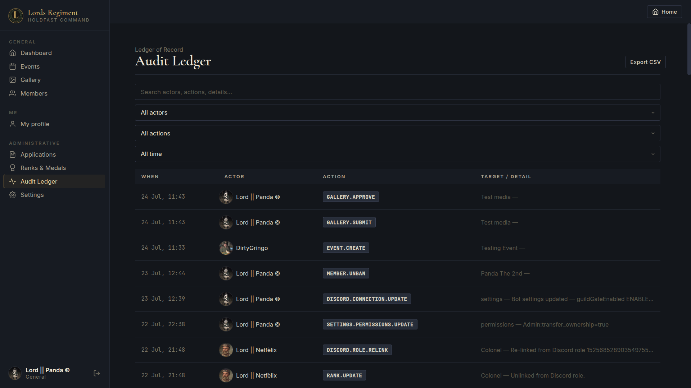</td>
<td width="16.66%">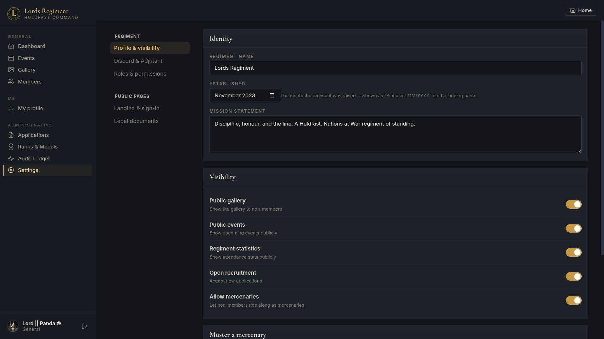</td>
<td width="16.66%">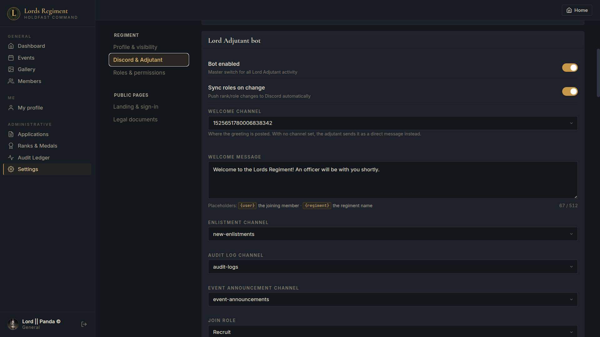</td>
<td width="16.66%">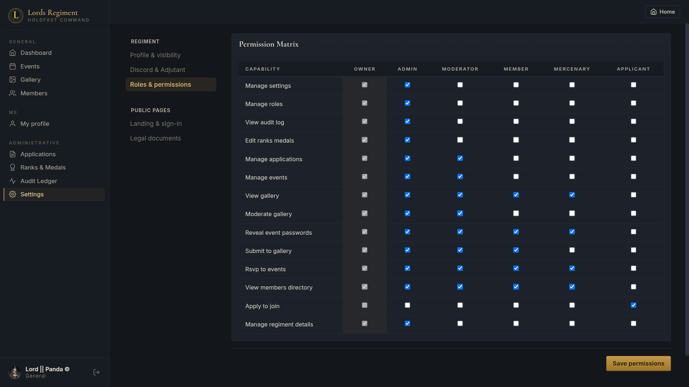</td>
<td width="16.66%">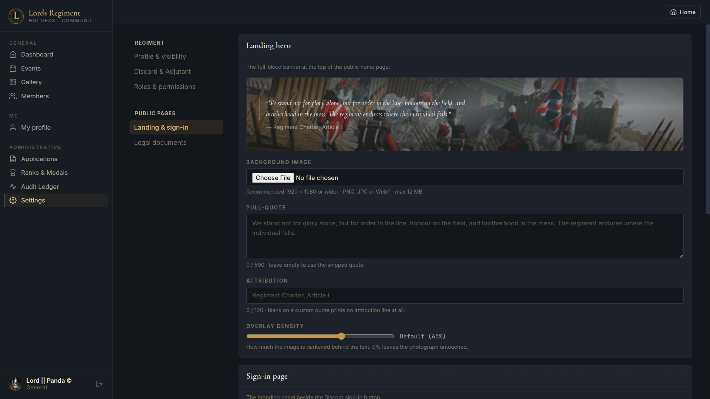</td>
</tr>
<tr>
<td width="16.66%">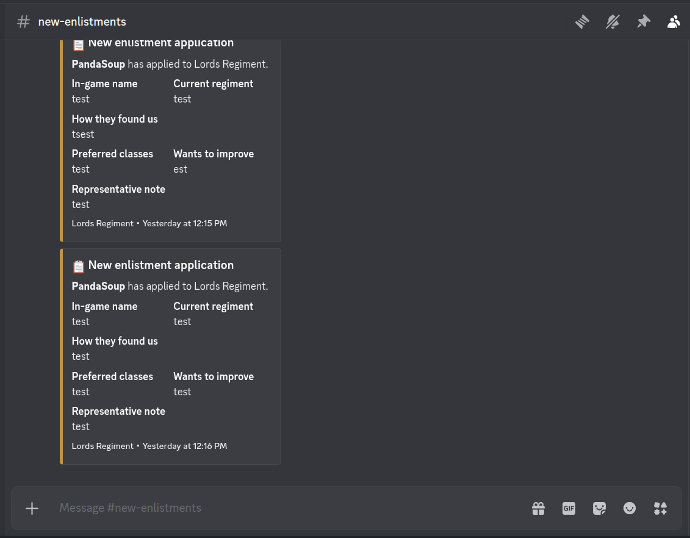</td>
<td width="16.66%">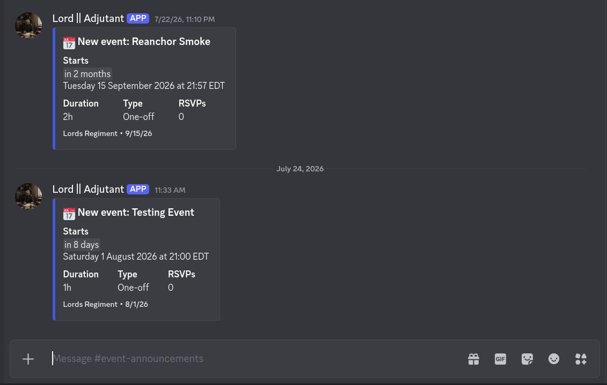</td>
<td width="16.66%">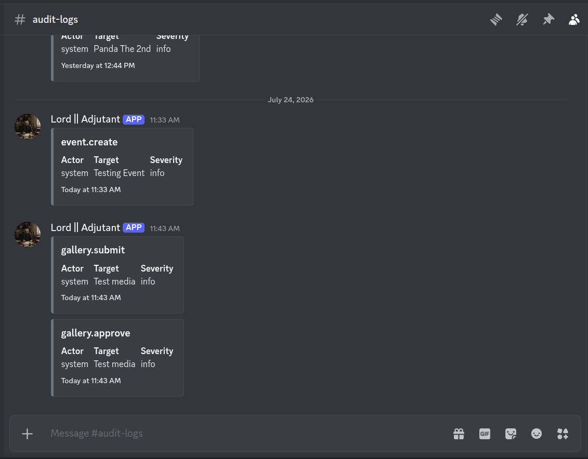</td>
<td width="16.66%">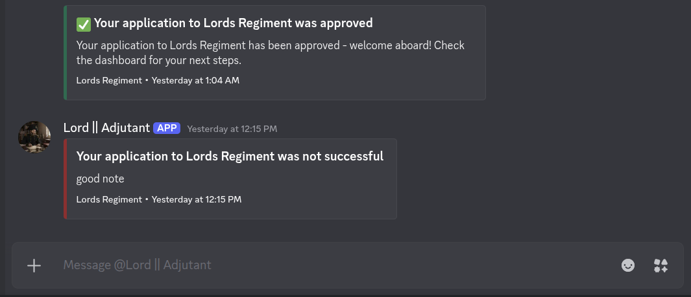</td>
<td width="16.66%"></td>
<td width="16.66%"></td>
</tr>
</table>

---

## 🚀 Quickstart

You need [Node](https://nodejs.org) `^22.22.3 || ^24.15.0 || >=26.0.0` and npm `>=10` (that's the `engines` field in `package.json`). Those are the Angular CLI's own floors, patch versions and all — it refuses to start below them.

```bash
git clone https://github.com/Amitoj02/lords-regiment-dashboard.git
cd lords-regiment-dashboard
npm ci
npm start          # http://localhost:4200
```

The public pages render immediately. For anything authenticated, bring the API up first — `ng serve` proxies `/api` to `http://localhost:3000` via [`proxy.conf.json`](./proxy.conf.json), and the backend's own quickstart is a `docker compose up` away in the [companion repo](https://github.com/Amitoj02/lords-dashboard-backend).

**You do not need a Discord application to develop against this.** The backend mocks Discord whenever `DISCORD_CLIENT_ID` is empty, which is the default for a local run. Sign in as a persona by visiting these **through the proxy** — port 4200, not 3000, so the whole flow stays same-origin:

| URL                                                 | Lands you as                                         |
| --------------------------------------------------- | ---------------------------------------------------- |
| `http://localhost:4200/api/auth/discord?as=owner`   | Full admin — every capability, all of `/app/admin/*` |
| `http://localhost:4200/api/auth/discord?as=recruit` | A signed-in non-member — walk the enlistment flow    |

<details>
<summary><strong>Prefer one command for both halves?</strong></summary>

The backend repo's Compose stack builds this app as its `web` service from `context: ../lords-regiment-dashboard`, so the **sibling checkout is load-bearing**:

```text
~/Repositories/
├── lords-dashboard-backend/
└── lords-regiment-dashboard/
```

From the **backend** checkout:

```bash
docker compose up --build                    # web + api + MySQL + object storage, hot-reloading
docker compose exec api npm run db:setup     # first run only: create → migrate → seed
```

|                            |                                  |
| -------------------------- | -------------------------------- |
| SPA                        | <http://localhost:4200>          |
| API (proxied, same origin) | <http://localhost:4200/api>      |
| Swagger                    | <http://localhost:4200/api/docs> |
| MySQL for host tools       | `127.0.0.1:3307`                 |

Docker and Docker Compose are the only prerequisites — no host Node, no host MySQL. Inside the stack this app is served by `ng serve` with [`proxy.conf.docker.json`](./proxy.conf.docker.json), and tooling runs in the container: `docker compose exec web npm run lint`.

</details>

> **Versions in this README mirror `package.json` as it stands today** — that file is the authoritative answer, and a framework upgrade may well land before this paragraph is rewritten.

---

## 🧭 Architecture

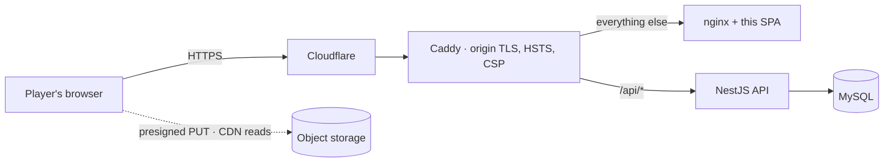

Four decisions shape everything else in this repo.

| Decision                                                            | Consequence                                                                                                                                                                                                                                            |
| ------------------------------------------------------------------- | ------------------------------------------------------------------------------------------------------------------------------------------------------------------------------------------------------------------------------------------------------ |
| `apiBaseUrl` is the **relative** string `/api` in both environments | The built bundle carries no hostname — one image works behind any domain, there is no CORS, and the Discord OAuth callback is same-site. The SPA **must** be same-origin with the API.                                                                 |
| **NgModule** architecture, `standalone: false` on every component   | Five lazy-loaded feature modules via `loadChildren`; `SharedModule` re-exports the design system plus `CommonModule` / `RouterModule` / `FormsModule` / `ReactiveFormsModule`.                                                                         |
| Authorization is **capability-based**, not role-based               | `AuthService.hasCapability()` reads `CurrentUser.capabilities`, computed by the API from its editable role-permissions matrix. Role checks (`isAdmin()`) exist but are the coarse fallback.                                                            |
| **No UI kit, no runtime helpers**                                   | Runtime dependencies are exactly `@angular/*`, `bootstrap`, `bootstrap-icons`, `rxjs`, `tslib` and `zone.js`. The Markdown renderer, media-embed resolver, toasts, avatars and video-poster capture are all in-repo. It is a posture, not an accident. |

**Routing.** Route tables are not all in one file: there is the root table in [`app-routing.module.ts`](./src/app/app-routing.module.ts) plus an inline table in each feature module. Declaration order matters — `guild-required` and `app/admin` are declared _before_ their prefix-matching siblings so the parent route can't swallow them.

**Guards are functions, not classes.** Eight `CanActivateFn` in [`src/app/core/guards/`](./src/app/core/guards) plus one `CanDeactivateFn` alongside the settings screen. `settings-access.guard.ts` exports `SETTINGS_CAPABILITIES` and the sidebar imports that same constant, so the link and the route it points at are physically incapable of disagreeing.

<details>
<summary>The guard table</summary>

| Guard                                                               | Gate                                                                            |
| ------------------------------------------------------------------- | ------------------------------------------------------------------------------- |
| `authGuard`                                                         | Signed in, else `/login`                                                        |
| `adminGuard`                                                        | Role ∈ Owner / Admin / Moderator, else `/app/dashboard`                         |
| `guildGuard`                                                        | The Discord guild gate — the only async guard (see below)                       |
| `onboardingGuard`                                                   | Signed in but not yet a member                                                  |
| `manageEventsGuard` · `submitGalleryGuard` · `moderateGalleryGuard` | One capability each                                                             |
| `settingsAccessGuard`                                               | Passes on **any** settings capability; exports the constant the sidebar imports |
| `unsavedChangesGuard`                                               | The lone `CanDeactivateFn` — confirms before leaving a dirty settings form      |

</details>

**Guards degrade, they never throw.** `guildGuard` runs against a 2500 ms navigation budget: a slow, failed or degraded check resolves to the verdict already held, so it can neither block anyone nor log them out. Its allowlist (`GATE_ALLOWED_URLS`) is matched by **exact path equality** — `/app/profile` is your own record and stays reachable, while `/app/profile/:id` (somebody else's) stays gated, and `/app/account-deletion` must stay reachable because Discord's developer terms require it. The recheck window is five minutes, the status call times out at eight seconds, concurrent callers share one in-flight request, and `isGuildGated()` compares `guildGateEnabled === true` explicitly so an older payload fails **open** rather than locking people out.

**Fourteen root-provided services** in [`src/app/core/services/`](./src/app/core/services) cover every API area; twelve of them talk to the API, and `ToastService` and `VideoPosterService` make no requests at all. There is no stub data left in this app — a remaining `of(...)` is almost always a `catchError` fallback (plus one default storage policy). Nothing here is waiting to be wired up.

**Uploads never touch the API.** `StorageService` fetches a cached policy, asks the API for a presigned PUT, then writes the bytes **straight to object storage** across nine targets (`member-avatar`, `member-banner`, `event-banner`, `medal-image`, `rank-image`, `gallery`, `gallery-poster`, `regiment-hero-banner`, `regiment-login-banner`). Per-target size and MIME caps come from `GET /storage/policy`, cached with `shareReplay(1)` behind a shipped default.

**Two XSS-sensitive surfaces, both hand-written and both allow-list first.** `MarkdownService` renders the admin-authored legal documents escape-first, with a protocol allow-list and a plain `[innerHTML]` binding — never `bypassSecurityTrustHtml`. `MediaEmbedService` classifies a gallery URL as `youtube` / `medaltv` / `image` / `video` / `link`, and only iframe sources are sent through `DomSanitizer`. If you audit one thing in this repo, audit [those two files](./src/app/shared/services).

<details>
<summary><strong>Project structure</strong></summary>

```text
src/
├── app/
│   ├── core/                    # singletons — provided in root, imported once
│   │   ├── guards/              # 8 functional CanActivateFn
│   │   ├── interceptors/        # jwt.interceptor.ts
│   │   ├── models/              # TS interfaces mirroring API responses
│   │   ├── services/            # 14 root services (12 of them talk to the API)
│   │   ├── title/               # AppTitleStrategy + PageTitleService
│   │   └── core.module.ts       # no providers; exists only to throw if imported twice
│   ├── shared/                  # SharedModule
│   │   ├── components/          # the 16 hf-* design-system components
│   │   ├── pipes/               # (empty today)
│   │   └── services/            # markdown.service.ts, media-embed.service.ts
│   ├── features/                # 5 lazy-loaded modules, 30 components
│   │   ├── public/              # landing, events, gallery, login, legal, auth callback
│   │   ├── onboarding/          # enlistment form + application status
│   │   ├── auth/                # the Discord guild gate
│   │   ├── member/              # /app/*        — dashboard, roster, profile, events, gallery
│   │   └── admin/               # /app/admin/*  — applications, ranks, audit, settings, bot
│   ├── app-routing.module.ts
│   └── app.module.ts
├── styles/                      # design tokens + the global SCSS layer
├── assets/images/               # crest, wordmark, in-game backdrops
└── environments/                # apiBaseUrl — relative '/api' in both
public/                          # favicons + PWA manifest, copied to the dist root
design-reference/                # runnable React design canvas — the UI source of truth
scripts/check-contrast.mjs       # WCAG AA contrast guard, enforced by `npm run lint`
nginx.conf                       # what serves the production build
```

47 component classes in `src/app` overall: 30 in the feature modules, the 16 shared `hf-*` components, and the root `AppComponent`.

</details>

<details>
<summary><strong>Details worth knowing before you change something</strong></summary>

- **Auth resolves before the first navigation.** An `APP_INITIALIZER` awaits `AuthService.hydrate()`, which short-circuits when no token exists and otherwise awaits `GET /auth/me` — so guards never see a half-populated session on the first route.
- **Signals where state is read by the chrome**, RxJS everywhere HTTP happens. `hf-app-shell` reads the `AuthService.currentUser` signal directly and owns the mobile off-canvas drawer, so login and logout reflow the chrome without a single subscription. `takeUntilDestroyed(this.destroyRef)` is the house teardown idiom.
- **Every route sets a document title.** `AppTitleStrategy` writes on _every_ navigation (unlike `DefaultTitleStrategy`) in the format `"<Page> | Lords Regiment"`, and never throws — a throw in `updateTitle` aborts navigation app-wide. Titles live only on leaf routes on purpose: `TitleStrategy` takes the deepest one it finds, so a title on a shell route would silently become the fallback for every child that forgot its own.
- **Production silences `console.log/debug/info`** in [`main.ts`](./src/main.ts); warnings and errors survive. Bootstraps with `ngZoneEventCoalescing: true`.
- **`CoreModule` holds no providers at all** — everything is `providedIn: 'root'` or a function. It exists solely to throw if it is imported twice.
- **Build budgets** (production): the initial bundle warns at 620 kB and errors at 1 MB; any single component stylesheet warns at 6 kB and errors at 8 kB. That is the mechanism that keeps the no-extra-dependencies posture honest.
- [`CLAUDE.md`](./CLAUDE.md) is the long-form architecture reference — richer than this section, and honest about its own stale corners (some routing details predate the current `/app/*` layout).

</details>

---

## 🔌 The contract with the API

This repo and [lords-dashboard-backend](https://github.com/Amitoj02/lords-dashboard-backend) are two halves of one product and are deployed together.

- **Sign-in.** `AuthService` performs a top-level navigation to `/api/auth/discord`. The API redirects back to `/auth/callback` with the JWT in the **URL fragment** (`#token=…&isMember=…`) — never the query string, so the token never reaches a server access log or a `Referer` header. `AuthCallbackComponent` reads it, `history.replaceState`s it away, persists it under the `localStorage` key `lords_access_token`, hydrates, and routes on.
- **Session state.** `GET /api/auth/me` returns the `CurrentUser` projection that populates `AuthService.currentUser` (an Angular `signal`). [`src/app/core/models/`](./src/app/core/models) mirrors the API's response shapes; the backend's `SCHEMA.md` and its current-user DTO are the source of truth for them — read those rather than guessing.
- **Requests.** A functional `HttpInterceptorFn` attaches `Authorization: Bearer <token>` **only** when the URL starts with `environment.apiBaseUrl`, so the presigned PUT to object storage goes out untouched. A 401 from an API URL clears the session and routes to `/login` — except for `/auth/me`, where hydration handles it (otherwise an anonymous visitor would be bounced off the landing page).
- **Per-member permissions.** Admin actions against a _specific_ member are gated on the server-computed `member.permittedActions` block, so the action modal cannot drift from what the API will actually accept.

---

## 🎨 Design system


Dark regimental military: near-black ink surfaces, brass and antique gold as the primary accent, laurel green and oxblood pulled straight out of the crest, parchment for light panels, and deliberately near-square corners so nothing reads as a modern SaaS card.

Every colour, font and radius is a CSS custom property on `:root` in **[`src/styles/_variables.scss`](./src/styles/_variables.scss)**. Never hardcode a hex that already has a token.

| Family                                                                                                      | Role                                                     | Anchor    |
| ----------------------------------------------------------------------------------------------------------- | -------------------------------------------------------- | --------- |
|  `--ink-900` … `--ink-400`             | Surfaces: page → canvas → panel → row hover → muted icon | `#0b0e14` |
|  `--brass-100` … `--brass-700`       | The primary accent                                       | `#b08436` |
|  `--laurel-400` … `--laurel-700`    | Regimental green, from the wreath on the crest           | `#6c7e54` |
|  `--oxblood-300` … `--oxblood-700` | Regimental red, destructive actions                      | `#a64d44` |
|  `--parch-50` … `--parch-900`    | Light surfaces and document bodies                       | `#f3ecd9` |
|  `--regblue-300` … `--regblue-700`   | Steel blue, informational                                | `#4f6b8a` |

Plus hairlines (`--rule`, `--rule-2`, `--rule-3`), semantics (`--ok` `--warn` `--err` `--info`) and text ramps (`--t-100` … `--t-500`, `--t-on-parch`). Type is Cormorant Garamond (`--serif`), Inter (`--sans`) and JetBrains Mono (`--mono`); radii run `--r-1: 2px` → `--r-4: 6px`.

The global SCSS layer is composed in a fixed order in [`src/styles.scss`](./src/styles.scss): variables → bootstrap → base → buttons → forms → components → layout → onboarding → **responsive last**, so mobile rules always win. Breakpoints are 820 px (sidebar collapses into an off-canvas drawer, bottom nav appears) and 480 px (the narrow-phone pass) — check visual changes at 390 px and 768 px, not only on desktop.

**Sixteen shared components**, all prefixed `hf-` and all declared and exported by `SharedModule`. Reach for one of these, or an existing global class, before writing new component SCSS:

`hf-app-shell` · `hf-sidebar` · `hf-topbar` · `hf-bottom-nav` · `hf-avatar` · `hf-badge` · `hf-notice` · `hf-medal` · `hf-rank-icon` · `hf-crest-divider` · `hf-platform-badges` · `hf-event-status` · `hf-stat-tile` · `hf-gallery-card` · `hf-toast` · `hf-coming-soon`

### Contrast is a lint error, not a review comment

`npm run lint` runs [`scripts/check-contrast.mjs`](./scripts/check-contrast.mjs) after `ng lint`. It parses every component stylesheet, resolves `background` / `background-color` and `color` against the token file (including colour inherited from an ancestor rule in the same file), computes the real WCAG 2.1 ratio and fails anything below **4.5:1**. It deliberately skips what it cannot evaluate honestly — gradients, `color-mix()`, `rgba()` / `hsla()`, `inherit`, `transparent`, `currentColor`. The escape hatch is a `// contrast-guard-ignore: <reason>` comment inside the block, and the reason is mandatory. It exists because a toast once shipped parchment on parchment at roughly 1.1:1.

### Design reference

The canonical UI source of truth is [`design-reference/`](./design-reference) — not a folder of dead wireframes but a **runnable React design canvas**. Open `design-reference/Holdfast Command.html` in a browser (it pulls React and Babel from a CDN, so it needs network) and you get labelled artboards for the whole product — public, onboarding, member, admin and mobile — plus a design-system plate. Its own subtitle reads _"Self-hosted, Discord-native. Plate I — 20 screens & a design system."_ When a screen exists there, match it; when it doesn't, follow the established language.

---

## 📜 npm scripts

| Script                  | Command                                           | What it does                                                                                    |
| ----------------------- | ------------------------------------------------- | ----------------------------------------------------------------------------------------------- |
| `npm start`             | `ng serve`                                        | Dev server on `:4200`, proxying `/api` → `localhost:3000`                                       |
| `npm run build`         | `ng build`                                        | Production build (it is the default configuration) into `dist/lords-regiment-dashboard/browser` |
| `npm run watch`         | `ng build --watch --configuration development`    | Rebuild on change                                                                               |
| `npm test`              | `ng test`                                         | Karma + Jasmine in watch mode                                                                   |
| `npm run test:ci`       | `ng test --watch=false --browsers=ChromeHeadless` | One headless run — what CI executes                                                             |
| `npm run lint`          | `ng lint && npm run lint:contrast`                | ESLint over `*.ts` / `*.html`, then the contrast guard                                          |
| `npm run lint:fix`      | `ng lint --fix`                                   | Lint with auto-fix                                                                              |
| `npm run lint:contrast` | `node scripts/check-contrast.mjs`                 | The WCAG AA guard on its own                                                                    |
| `npm run format`        | `prettier --write .`                              | Format the repo                                                                                 |
| `npm run format:check`  | `prettier --check .`                              | Verify formatting — CI fails on a diff                                                          |
| `npm run ng`            | `ng`                                              | The Angular CLI passthrough                                                                     |

---

## 🧪 Testing & CI

```bash
npm run format:check   # first, and unforgiving
npm run lint           # eslint + the contrast guard
npm run build          # production build — catches budget and AOT failures
npm run test:ci        # headless unit tests
```

Karma and Jasmine, **56 spec files** sitting beside the code they cover — services, guards, models and components. `npm test` watches; `npm run test:ci` is the single headless pass.

**There is no end-to-end suite in this repository**, so unit specs are the whole safety net here and behavioural changes need one. Write specs that pin the _reason_ a thing exists rather than its current output, and prefer `RouterTestingHarness` for anything routing-shaped: several bugs in this app only appear on the _second_ navigation. Full-stack e2e lives in the backend as Jest + Supertest suites against a real MySQL database; see that repo's [CONTRIBUTING.md](https://github.com/Amitoj02/lords-dashboard-backend/blob/main/CONTRIBUTING.md) for the isolated-database recipe.

**CI** — [`.github/workflows/ci.yml`](./.github/workflows/ci.yml), workflow **CI**, job **Lint, build & test**. Runs on a push to any branch and on pull requests into `main` or `dev`, in the four-step order above. It declares top-level `permissions: contents: read` and references **no secrets at all**, so a fork PR runs the identical gate. The CI Node major deliberately tracks the Dockerfile's base image — testing on a different major than the release build ships is how a runtime regression slips past.

**Dependabot** runs weekly across npm, GitHub Actions and Docker base images, and opens against `dev` rather than `main`. The npm `angular` group is deliberately wide — `@angular/*`, `@angular-devkit/*`, `@schematics/*`, `angular-eslint`, `zone.js` and `typescript` — because Angular peers all of them to one another. A bump that arrives without its siblings cannot resolve, and no amount of rebasing makes it mergeable.

<details>
<summary><strong>Traps that have cost real time</strong></summary>

- ⚠️ **Do not re-enable `optimization.styles.inlineCritical`.** It is pinned `false` for production builds in `angular.json` because the edge CSP sets `script-src 'self'`: Angular's critical-CSS inliner rewrites the stylesheet link with an inline `onload` handler, the CSP blocks it, and the sheet stays stranded at `media="print"` — a live, half-styled site. It fails _only_ in production, because `ng serve` sends no CSP. The full reasoning is in [`CLAUDE.md`](./CLAUDE.md).
- ⚠️ **Bootstrap's `.row > * { width: 100% }` collides with the custom `.row`** in `_base.scss`, which overrides it with `> * { width: auto }`. Removing that "redundant" line silently stretches layouts far from where you deleted it.
- **Prettier is 4-space here**, with a `parser: "html"` override for `*.component.html` (Angular's own parser is locked to 2-space). JSON, YAML and Markdown are 2-space by design. See [`.prettierrc.json`](./.prettierrc.json).
- **`WEB_ORIGIN` on the backend must include the port** — `http://localhost:4200`, not `http://localhost`, or Discord rejects the `redirect_uri` and it looks like a broken login page in _this_ repo.
- **Broken gallery images are usually the object store, not this app.** Media URLs arrive fully qualified from the API; the frontend has no storage base URL of its own.
- **Sass `@import` deprecation warnings are expected** and silenced in `angular.json` pending a `@use` migration. Don't fix one file in isolation.

</details>

---

## 🐳 Docker & deployment

The [`Dockerfile`](./Dockerfile) is multi-stage: `deps` → `dev` (`ng serve`, hot reload, port 4200) → `build` (AOT production bundle) → `prod`, an `nginx:alpine` image serving the built SPA on port 80. [`nginx.conf`](./nginx.conf) serves the SPA fallback, proxies `/api/` to `http://api:3000` with the path prefix preserved, sets 30-day immutable caching on fingerprinted assets and `no-store` on `index.html`, and repeats `X-Content-Type-Options`, `X-Frame-Options` and `Referrer-Policy` as defence in depth — an nginx `add_header` at location level suppresses inherited server-level ones, so the duplication is deliberate. Caddy at the edge remains the authoritative source of TLS and CSP.

**Release** — [`.github/workflows/release.yml`](./.github/workflows/release.yml), workflow **Release**. On a merge to `main` (or manual dispatch) it builds the `prod` stage and pushes the web image to GHCR tagged with the commit SHA and `latest`. **Merging changes nothing live.**

**Deploy** — a human then runs the `Deploy to production` workflow **in the backend repo**, which takes an `api_tag` and a `web_tag` separately (the two images come from two repos and therefore two different SHAs) and rolls the Compose stack on the VPS. There is no deploy workflow here by design. Rollback is the same workflow with the previous pair of tags.

In our own deployment that image runs on a single small VPS behind Cloudflare and Caddy, sharing an origin with the API so there is no CORS and the Discord callback stays same-site. If you're standing your own copy up, the full topology, the deploy runbook and the backup story are documented in the backend repo: [`docs/INFRASTRUCTURE.md`](https://github.com/Amitoj02/lords-dashboard-backend/blob/main/docs/INFRASTRUCTURE.md) and [`deploy/README.md`](https://github.com/Amitoj02/lords-dashboard-backend/blob/main/deploy/README.md).

---

## 🤝 Contributing

**Contributions are wanted, and small ones are wanted most.** A typo fix, a spec that pins behaviour we only _think_ is covered, a contrast failure we haven't noticed, a paragraph of documentation that would have saved you an hour — all of that is real work and all of it is welcome.

Read [**CONTRIBUTING.md**](./CONTRIBUTING.md) first. It is written for someone who has never seen this codebase: how the two repos sit side by side, the day-to-day loop, what CI gates, how cross-repo changes ship together, and the traps above in more detail.

**Good places to start:**

- **Run the quickstart.** If anything in it is wrong, out of date or confusing, that is a bug — [open an issue](https://github.com/Amitoj02/lords-regiment-dashboard/issues) and say exactly where you got stuck.
- **Pick a component without a spec** and write one that pins _why_ it behaves the way it does. If you're new to Angular's NgModule style, [`src/app/shared/components/`](./src/app/shared/components) is self-contained and every component next to it shows the house pattern.
- **Run `npm run lint:contrast`** and improve a component that only just scrapes past 4.5:1.
- **Check a screen at 390 px** against the matching artboard in `design-reference/` and fix the drift.
- **Reuse something.** If you're building this for your own community, the design tokens, the contrast lint, the capability-driven guards and the presigned-upload service are the pieces most worth lifting wholesale.

**A few things worth knowing up front:**

- **`npm run format:check && npm run lint && npm run test:ci && npm run build` is the whole gate.** Run it locally and CI will agree with you.
- **Open an issue first for anything large.** For a small fix, just send the PR — the [issue templates](./.github/ISSUE_TEMPLATE) and [PR template](./.github/pull_request_template.md) will prompt you for what a reviewer needs.
- **You've never played Holdfast?** Fine. Most of the work here is Angular, SCSS and accessibility, and the vocabulary decodes fast: a _regiment_ is the clan, a _rank_ is a permission tier that also maps to a Discord role, a _medal_ is an award, a _line battle_ is the weekly event everyone turns out for.
- **Changes that touch the API contract need both repos.** Say so in your PR and cross-link the counterpart — the API is [lords-dashboard-backend](https://github.com/Amitoj02/lords-dashboard-backend). They must merge and deploy together.
- **Conduct.** Everyone taking part is covered by the [Code of Conduct](./CODE_OF_CONDUCT.md). It's short, and it is the ordinary Contributor Covenant pledge: be decent to people.

### 🔐 Security

Please don't open a public issue for a vulnerability. Report it through a [private security advisory](https://github.com/Amitoj02/lords-regiment-dashboard/security/advisories/new) or by email to `contact@amitoj.dev` — [`SECURITY.md`](./SECURITY.md) has the scope and a 72-hour acknowledgement target. Issues in the API belong in the [backend repo's](https://github.com/Amitoj02/lords-dashboard-backend) advisory queue instead.

---

## 📚 Further reading

| Document                                                                                                                 | What's in it                                                                                                           |
| ------------------------------------------------------------------------------------------------------------------------ | ---------------------------------------------------------------------------------------------------------------------- |
| [`CONTRIBUTING.md`](./CONTRIBUTING.md)                                                                                   | The developer flow — setup, both repos side by side, testing, cross-repo changes, and the traps that cost an afternoon |
| [`CLAUDE.md`](./CLAUDE.md)                                                                                               | Long-form architecture and design-system reference                                                                     |
| [`design-reference/`](./design-reference)                                                                                | The runnable design canvas — the canonical UI/UX source of truth                                                       |
| [`SECURITY.md`](./SECURITY.md) · [`CODE_OF_CONDUCT.md`](./CODE_OF_CONDUCT.md)                                            | Disclosure policy and community expectations                                                                           |
| [Backend `README.md`](https://github.com/Amitoj02/lords-dashboard-backend/blob/main/README.md)                           | The API: stack, setup, auth flow, route table                                                                          |
| [Backend `SCHEMA.md`](https://github.com/Amitoj02/lords-dashboard-backend/blob/main/SCHEMA.md)                           | The normalised schema, enums, the authorization matrix, the identity model                                             |
| [Backend `docs/INFRASTRUCTURE.md`](https://github.com/Amitoj02/lords-dashboard-backend/blob/main/docs/INFRASTRUCTURE.md) | What runs where, and every path a request can take                                                                     |

---

## 📄 License

[MIT](./LICENSE) © 2026 Amitoj Singh.

You are free to fork this, rename it after your own regiment, strip the brass out of the design tokens and run it for a community that has nothing to do with muskets. If you do, we'd love to hear about it.

The regiment's crest, wordmark and the in-game imagery under `src/assets/images/` are project branding and game media, not part of the MIT grant on the source code — see [NOTICE](./NOTICE). Bring your own art.

---

<sub>_Holdfast: Nations At War_ is developed and published by [Anvil Game Studios](https://anvilgamestudios.com/) — independent, Maltese, and responsible for the fact that a few hundred people voluntarily stand in a straight line on a Tuesday evening. This project is unofficial, fan-built community software, unaffiliated with and unendorsed by them, and built for the players who spend their evenings holding a line together. If you want to decode the vocabulary in this codebase, the wiki's [Crews &amp; Regiments](https://wiki.holdfastgame.com/Crews_&_Regiments) and [Linebattles](https://wiki.holdfastgame.com/Linebattles) pages explain it better than any comment here could.</sub>
